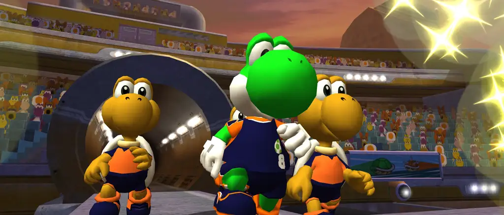

# Strikers - A native PC Port of Super Mario Strikers

**Download:**&nbsp;&nbsp;

*Requires game data from your own copy of Super Mario Strikers. No game assets are included.*

Super Mario Strikers, rebuilt to run natively on Windows, Linux, macOS and Nintendo Switch, with modern display support, configurable controls and a focus on performance across both powerful and low-power hardware.

Built on the community decompilation by the excellent [Yannick Suter](https://github.com/yannicksuter), this project brings the original game to modern systems while preserving the original gameplay and visual style.

## Features

- High framerate support with configurable frame limits and VSync.
- Widescreen and ultrawide support, with an expanded view of the pitch and corrected aspect ratios.
- Higher-resolution rendering with adjustable internal resolution, 4x MSAA and up to 16x anisotropic filtering.
- Texture packs ([guide](https://github.com/new-coke/strikers/wiki/Texture-packs)).
- Modern graphics backends through Metal, Vulkan and Direct3D 12 via [Aurora](https://github.com/encounter/aurora), with experimental OpenGL and OpenGL ES options on Linux. Vulkan is personally recommended on non-macOS systems. 
- Controller support for Xbox, PlayStation, Switch Pro and compatible GameCube adapters through SDL.
- Button prompts follow the active keyboard or controller and its bindings with selectable controller artwork.
- Customisable controls, including keyboard and gamepad bindings, stick deadzones and rumble.
- Faster loading compared with original hardware.
- Direct disc-image loading from ISO/GCM, CISO and GCZ files, alongside extracted game folders.
- US, European and Japanese game support in one executable, with region-aware saves and language handling. The Japanese disc supports Japanese, English, German, French, Spanish and Italian.
- A dedicated settings app for configuring graphics, controls, audio and game-data location. Some basic localisation included to help.
- Discord Rich Presence support, disabled by default.

## Installation

Download your platform's archive above or from [Releases](https://github.com/new-coke/strikers/releases), then follow its page on the [wiki](https://github.com/new-coke/strikers/wiki):

- [Windows](https://github.com/new-coke/strikers/wiki/Windows)
- [macOS](https://github.com/new-coke/strikers/wiki/macOS)
- [Linux](https://github.com/new-coke/strikers/wiki/Linux)
- [Steam Deck](https://github.com/new-coke/strikers/wiki/Steam-Deck)
- [Nintendo Switch](https://github.com/new-coke/strikers/wiki/Nintendo-Switch)

The wiki also lists the supported discs and how to report a problem. [Troubleshooting](https://github.com/new-coke/strikers/wiki/Troubleshooting) covers issues you may have playing or installing the game.

## Notes

This has been a solo effort. I am releasing this on what is effectively a 'burner' GitHub account because I don't want it attached to my name for professional and legal reasons. I have not done this port for reasons of ego or notoriety. Mario Strikers is one of my favourite games and it's been a dream of mine to bring it to the PC platform without the pains of emulation. My goal is simply to have it running on Steam Deck or similar low-end hardware with as little power draw as possible and nice performance, as I play the original game on Steam Deck a lot and bring it to parties and such.

[Yannick Suter](https://github.com/yannicksuter), who headed the decomp effort, and the other contributors deserve a ton of credit for the work that's gone into the mind-numbing process of decompilation. And of course, the team behind [Aurora](https://github.com/encounter/aurora), for making this kind of project as easy as possible, deserve endless respect.

Thanks also to [devkitPro](https://devkitpro.org) and [switchbrew](https://switchbrew.org) for the Switch toolchain and libnx, [danfromtico](https://github.com/danfromtico) for NVK on Switch, and [Dolphin](https://dolphin-emu.org) for the texture pack format.

Pull requests are welcome, but it's more than likely this project will be forked by people more invested than I, as I feel like my job is done.

## Licensing

This project contains material with different licences and rights statuses.

My original porting code, tools and documentation are offered under CC0 1.0, except where otherwise noted, and only to the extent that I own the relevant rights. This does not relicense third-party material or grant rights to the original game.

The main distinctions are:

- Reconstructed game code: this is an unofficial source reconstruction, not an official source release. Reconstructed material may remain subject to third-party rights; this project claims no ownership of those rights and grants no permission on behalf of their holders.
- MusyX audio middleware: the upstream decompilation carries an MIT licence, which is preserved here. That notice does not, by itself, establish that its licensors hold all rights in the reconstructed middleware.
- ODE physics: upstream ODE portions use the historical BSD-style licence preserved in the repository. That licence does not, by itself, establish the licensing status of independently copyrightable game-specific modifications.
- Button prompt artwork: [Input Prompts](https://kenney.nl/assets/input-prompts) by Kenney, under CC0 1.0. 
- Discord Rich Presence: [borealis](https://github.com/encounter/borealis) by Luke Street and [nlohmann/json](https://github.com/nlohmann/json) by Niels Lohmann, both MIT.
- Switch build: NVK from [mesa-switch](https://github.com/danfromtico/mesa-switch) (MIT, see 'NOTICE-NVK.md'); [libnx](https://github.com/switchbrew/libnx) (ISC); devkitPro's SDL2 (zlib), Mesa EGL/OpenGL ES and libdrm_nouveau (MIT); [sdl3on2](https://github.com/new-coke/sdl3on2) (zlib); [dawn-switch](https://github.com/new-coke/dawn-switch) (BSD 3-Clause).
- Settings app: [Qt 6](https://www.qt.io), under the LGPL 3.0.
- FreeType: portions of this software are copyright The FreeType Project (www.freetype.org). All rights reserved.
- Other third-party material and dependencies: these retain their applicable licences, and each archive includes their notices. FFmpeg's terms depend on its build configuration.

The project distributes source code and compiled releases. These do not include game assets; you must supply game data from your own copy. Distribution does not grant permission to reuse or redistribute third-party material beyond its applicable licences and rights.

This is an unofficial project, unaffiliated with and not endorsed by Nintendo or Next Level Games.
